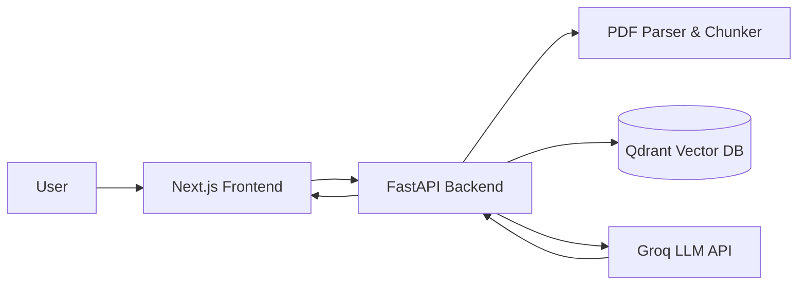

# 🧠 RAGVault — Intelligent Document Analysis with RAG

> **Intelligent Document Analysis with Retrieval-Augmented Generation (RAG)**  
> *Chat with your PDF documents securely, accurately, and interactively.*


---

# 📖 Overview

**RAGVault** is a full-stack AI application that enables users to upload PDF documents and perform Question & Answer (Q&A) using Retrieval-Augmented Generation (RAG).

The system parses documents, builds vector embeddings, stores them in Qdrant Vector Database, and uses LLMs via Groq API to generate grounded answers with verifiable citations.

A key feature is the Split-View PDF Source Viewer — users can click citations and instantly jump to the exact page in the document with highlight support.

Designed for **large-scale multi-document RAG (hundreds to thousands of PDFs).**

---

# ✨ Features

- 📄 Seamless PDF ingestion & chunking
- 🧠 Context-aware RAG question answering
- 📍 Precision source citations
- 👁️ Split-view PDF Source Viewer
- 🔎 Click-to-jump citation navigation
- 🎯 Highlighted source text anchors
- 🗑️ Knowledge base file management
- ⚡ FastAPI high-performance backend
- 🌐 Next.js modern frontend UI
- 🐳 Fully Dockerized microservice stack

---

# 🛠 Tech Stack

## Frontend
- Next.js 14 (React)
- Tailwind CSS
- React Hooks
- Custom PDF Viewer (iframe + anchor highlight)
- Lucide Icons
- Axios

## Backend
- FastAPI
- Python
- Custom RAG pipeline
- PDF parsing & chunking
- Embedding generation
- Citation mapping logic

## AI / RAG Layer
- Retrieval-Augmented Generation (RAG)
- Vector similarity search
- Source-grounded answer generation

## Vector Database
- Qdrant Vector DB
- Persistent storage volume

## LLM Inference
- Groq API
- Llama 3 / Mixtral models

## Infrastructure
- Docker
- Docker Compose
- Multi-container architecture

---

# 🏗 Architecture



---

# 🎬 Demo Video

📺 Watch full walkthrough:

https://your-demo-video-link

Recommended demo flow:
- Upload PDF
- Index documents
- Ask question
- Show answer with citation
- Click source
- PDF viewer jumps + highlights

---

# 🖼 Screenshots

```md
## Interface


## Source Highlight Viewer

```

---

# ⚙️ Installation

## Requirements

- Docker Desktop
- Git

---

# 🐳 Docker Setup (Recommended)

## 1️⃣ Clone Repository

```bash
git clone https://github.com/your-username/RAGVault.git
cd RAGVault
```

---

## 2️⃣ Configure Environment Variables

Create `.env` file:

```bash
GROQ_API_KEY=gsk_your_api_key_here
```

---

## 3️⃣ Build & Run

```bash
docker-compose up -d --build
```

---

## 4️⃣ Access Services

Frontend → http://localhost:3000  
Backend Docs → http://localhost:8000/docs  
Qdrant Dashboard → http://localhost:6333/dashboard

---

# 🚀 Usage — Step by Step

## Step 1 — Upload Documents
Upload PDF files via UI → system parses, chunks, embeds, and stores vectors.

## Step 2 — Manage Knowledge Base
View indexed documents in sidebar → delete to remove vectors + files.

## Step 3 — Ask Questions
Type query → RAG retrieves relevant chunks → LLM generates grounded answer.

## Step 4 — Verify Sources
Click **Check Source** → PDF viewer opens → jumps to page → highlights anchor text.

## Step 5 — Interactive Review
Toggle viewer panel → navigate between sources → verify grounding.

---

# 📂 Project Structure

```
RAGVault/
├── backend/
│   ├── app/
│   ├── Dockerfile
│   └── requirements.txt
│
├── frontend/
│   ├── src/
│   │   ├── components/
│   │   ├── pages/
│   │   └── styles/
│   ├── Dockerfile
│   └── package.json
│
├── data/
│   ├── uploads/
│   └── qdrant_storage/
│
├── docker-compose.yml
├── .env
└── README.md
```

---

# 🔌 API Endpoints

```
POST   /upload
GET    /files
DELETE /files/{filename}
POST   /chat
```

---

# 📈 Roadmap

- [ ] Hybrid search (BM25 + vector)
- [ ] Multi-query retrieval
- [ ] Confidence scoring
- [ ] Streaming answers
- [ ] Multi-user support

---

# 🤝 Contributing

Pull requests are welcome. Please open an issue first for major changes.

---

# 📄 License

MIT License
