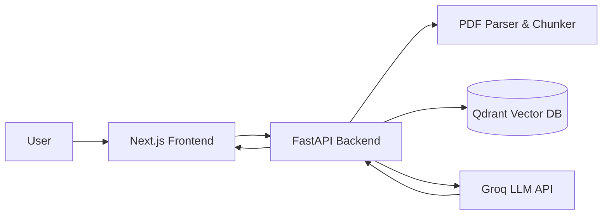

# RAGVault — Intelligent Document Analysis with RAG

> **Document Analysis with Retrieval-Augmented Generation (RAG)**  
> *Chat with your PDF documents accurately with verifiable sources.*


---

# 📖 Overview

**RAGVault** is a full-stack Retrieval-Augmented Generation (RAG) application for analyzing and querying large collections of PDF documents using AI. Built for users that need to quickly extract information from **many documents at once** without manually reading everything.

### Example Use Cases

- Searching answers across dozens of PDFs
- Research paper exploration
- Technical document Q&A
- Internal knowledge base search
- Compliance and policy document lookup
- Academic literature review assistant

RAGVault processes PDFs into vector embeddings, retrieves the most relevant passages, and generates answers, complete with **direct quoted citations** and a PDF viewer for verification.

---

# ✨ Features

- Multi-document PDF ingestion
- Retrieval-Augmented Generation (RAG) Q&A
- Grounded answers with quoted sources
- Split-view chat + PDF reader
- FastAPI backend
- Next.js frontend
- Fully Dockerized stack

---

# 🛠 Tech Stack

## Frontend
- Next.js 14
- React
- Tailwind CSS
- Custom PDF Viewer Panel
- Axios
- Lucide Icons

## Backend
- FastAPI
- Python
- Custom PDF parsing & chunking pipeline
- RAG retrieval engine

## AI Layer
- Retrieval-Augmented Generation
- Embedding + similarity search
- Source citation mapping

## Vector Database
- Qdrant Vector Database
- Persistent vector storage

## LLM Inference
- Groq API
- Llama / Mixtral models

## Infrastructure
- Docker
- Docker Compose
- Multi-container architecture

---

# 🏗 Architecture



---

# ⚙️ Installation & Setup

Follow these steps to get **RAGVault** running locally using Docker.

## Prerequisites

- Docker Desktop installed and running
- Git installed

---

## 1️⃣ Clone Repository

```bash
git clone https://github.com/your-username/RAGVault.git
cd RAGVault
```

---

## 2️⃣ Configure Environment Variables

Create a `.env` file in the root directory.

You can copy from example:

```bash
cp .env.example .env
```

Or create manually.

### Required `.env` content

```ini
# Groq API Key (https://console.groq.com/keys)
GROQ_API_KEY=gsk_your_api_key_here

# Frontend → Backend API URL (Docker default)
NEXT_PUBLIC_API_URL=http://localhost:8000
```

---

## 3️⃣ Run with Docker 🐳

Build and start all services:

```bash
docker-compose up -d --build
```

This will start:

- Frontend (Next.js)
- Backend (FastAPI)
- Vector Database (Qdrant)

---

## 4️⃣ Access the Application

Frontend UI  
http://localhost:3000

Backend API Docs  
http://localhost:8000/docs

Qdrant Dashboard  
http://localhost:6333/dashboard

---

# 🚀 Application Usage

## 1️⃣ Upload Documents

Users can upload PDF files through the interface.  
The backend will automatically:

- parse document text
- split into semantic chunks
- generate embeddings
- store vectors in Qdrant

<video src="docs/upload-demo.mp4" controls width="700"></video>

---

## 2️⃣ Delete Documents

Uploaded documents can be removed from the knowledge base.

Deletion will:

- remove the file from storage
- delete associated embeddings from the vector database
- immediately exclude the document from future RAG answers

<video src="docs/delete-demo.mp4" controls width="700"></video>

---

## 3️⃣ Chat with RAG

Users can ask questions about the uploaded documents.

The system will:

- retrieve relevant chunks
- generate an AI answer
- include **quoted source text**
- show exactly which document and page the answer came from

The answer panel displays:
- AI response
- source quote
- page number
- clickable source button

<video src="docs/chat-demo.mp4" controls width="700"></video>

---

## 4️⃣ Interactive Source PDF Viewer

Each answer source can be opened in the PDF viewer panel.

Viewer behavior:

- opens on the right side (split view)
- jumps directly to the cited page
- highlights anchor text
- can be closed or reopened anytime
- clicking a source automatically reopens the viewer and navigates to the correct page

<video src="docs/pdf-viewer-demo.mp4" controls width="700"></video>

---

# 📂 Project Structure

```
RAGVault/
├── backend/
│   ├── app/
│   ├── Dockerfile
│   └── requirements.txt
│
├── frontend/
│   ├── src/
│   │   ├── components/
│   │   ├── pages/
│   │   └── styles/
│   ├── Dockerfile
│   └── package.json
│
├── data/
│   ├── uploads/
│   └── qdrant_storage/
│
├── docker-compose.yml
├── .env
└── README.md
```

---

# 🔌 API Endpoints

```
POST   /upload
GET    /files
DELETE /files/{filename}
POST   /chat
```

---

# 📄 License

MIT License
